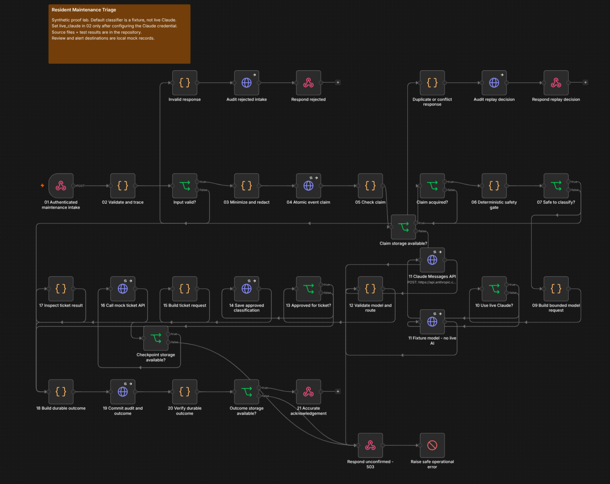

# Resident Maintenance Triage

An n8n proof lab that turns synthetic maintenance requests into validated mock tickets, human-review records, or recoverable failures.

**Status:** three importable workflows executed on n8n 2.37.10. The integration suite passed 24 scenarios using deterministic model fixtures; eight JavaScript tests also passed (six policy tests and two model-request contract tests). Chris subsequently verified live Claude classification through mock ticket creation, emergency bypass, and duplicate replay on his Linux computer. See [live demonstration evidence](evidence/live-claude-results.md) for provenance and outcomes. The repository still defaults to fixture mode. No real Zendesk, Yardi, resident, or employer systems are connected.

[Setup](docs/setup.md) · [Architecture](docs/architecture.md) · [Node walkthrough](docs/node-walkthrough.md) · [Test evidence](evidence/README.md) · [Runbook](docs/runbook.md) · [Try the demo](docs/demo.md)

## Workflow screenshot



Actual n8n workflow overview. The repository defaults to simulated classification, with optional live Claude.

## The business problem

Manual service intake requires staff to read messages, recognize urgent situations, fill in ticket fields, remove duplicates, and follow up when integrations fail. This lab demonstrates how to automate the repeatable work while preserving human review and a traceable outcome.

## What runs

| Component | Responsibility |
| --- | --- |
| `maintenance-triage.json` | Authenticated intake, validation, privacy rules, atomic claim, safety gate, model call, model validation, routing, ticket request, durable acknowledgement |
| `mock-ticket-api.json` | A second n8n webhook calls an idempotent local mock-ticket store |
| `maintenance-error-handler.json` | An automatically linked Error Trigger creates a sanitized recovery record and mock alert |
| `lab/server.py` | SQLite state, test model responses, mock ticket API, review queue, recovery records, and a local notification outbox |

The workflow calls the model once for eligible requests, with bounded retries on failure. It is a constrained classifier and routing workflow; it does not grant a language model open-ended tool access.

## Start locally

Use Node.js 24 and Python 3.10 or newer. The verified development runtime was Node.js 24.19.0, Python 3.12.13, and n8n 2.37.10 on Linux. Windows and macOS commands are provided; those operating systems were not tested in this build.

From the repository root:

```bash
npm install --prefix .local/n8n n8n@2.37.10 --no-audit --no-fund
python3 scripts/run_native.py --n8n-script .local/n8n/node_modules/n8n/bin/n8n
```

On Windows, use `python` instead of `python3`. Open `http://localhost:5678` after the terminal says the lab is ready. Create the local owner login if n8n prompts. This local Community Edition setup does not require an n8n Cloud subscription.

In a second terminal in the same directory:

```bash
python3 scripts/demo.py routine
python3 scripts/demo.py emergency
python3 scripts/demo.py ambiguous
python3 scripts/demo.py snapshot
```

Keep the first terminal running. Ctrl+C stops both processes. The ignored `.local` directory retains the database and encrypted n8n state. n8n's npm installation is deprecated for future major versions; this project pins the tested 2.x runtime. A Docker Compose option is included in [setup details](docs/setup.md), with its untested container status disclosed.

## Request and response contract

The endpoint is `POST /webhook/maintenance`. Authentication is the locally generated `X-Lab-Key` credential. `scripts/demo.py` reads it from the ignored `.env` file without printing it.

```json
{
  "source_event_id": "DEMO-001",
  "property_id": "PROP-DEMO-001",
  "unit": "2B",
  "message": "Water leaking beneath the kitchen sink.",
  "contact_preference": "none",
  "submitted_at": "2026-09-08T15:00:00Z",
  "synthetic": true
}
```

The demo client generates a current timestamp. Static samples expire after the configured 30-day input window; refresh their timestamp before using them later. Replays must retain the same ID **and the same normalized payload, including the timestamp**.

| HTTP | Meaning |
| --- | --- |
| 201 | A mock ticket exists and the durable outcome was committed |
| 202 | Human review/recovery recorded, or another execution already owns the event |
| 200 | The original disposition is returned for a completed duplicate |
| 400 / 413 / 415 | Invalid input, excessive size, or incorrect content type |
| 401 / 403 | Webhook authentication rejected |
| 409 | Same event ID with different content |
| 503 | Storage outcome unconfirmed; keep the same ID for reconciliation |

Check the response JSON `status`, not only its HTTP code. A 202 review response means a local queue record exists; it does not mean an actual dispatcher has been notified.

## What the evidence proves

- Routine intake traversed real n8n nodes, HTTP requests, and the second mock-ticket webhook.
- Eight simultaneous replays produced one model call and one ticket.
- Emergency and configured injection indicators bypassed the model.
- Strict schema checks prevented malformed or inappropriate classifications from reaching normal ticket creation.
- Known synthetic personal-data patterns were absent from stored event, ticket, review, and audit records.
- A transient model 429 recovered; permanent errors and timeouts exhausted three attempts and created recovery records.
- A lost response after a committed ticket write did not create a second ticket.
- A storage failure returned an explicit 503 and activated the linked Error Trigger. Operator reconciliation reused the existing ticket.

The fixtures test orchestration and failure behavior. They do **not** establish Claude accuracy, real-world safety coverage, production latency, or business savings.

## Enable real Claude

Open the n8n credential named **Claude API Key**, add your Anthropic API key, then change `live_claude: false` to `true` in **02 Validate and trace** and publish the workflow. This uses the official Messages API through an HTTP Request node. A Claude chat subscription and API billing are separate.

Use [the live validation checklist](docs/live-claude-checklist.md) before describing this as a live Claude integration. Never paste a key into workflow JSON, a Code node, a screenshot, or a GitHub file.

## Tests and source

```bash
node --test tests/policy.test.cjs tests/model-request.test.cjs
python3 scripts/verify_exports.py
python3 scripts/run_native.py --test --n8n-script .local/n8n/node_modules/n8n/bin/n8n
```

The `run_native.py --test` command starts and stops the native lab itself; stop a separately running native lab first. Its integration tests enable temporary faults in the local mocks. Run them before rehearsal, then use the normal demo commands. Results are written to `evidence/integration-results.json`.

JavaScript business rules live in `src/policy.cjs`; node-specific code lives in `src/nodes`. The deterministic generator `scripts/build_workflows.py` produces standalone n8n JSON exports. You can inspect every rule without reading a large escaped JSON string.

## Limitations

This is an independent, AI-assisted portfolio build. It is not affiliated with a property company or used by real residents. Emergency rules are illustrative, PII masking is incomplete, confidence is uncalibrated, and alerts go only to a local mock outbox. See [the complete limits and design decisions](docs/limitations.md). No measured ROI, real user adoption, or production deployment is claimed.

