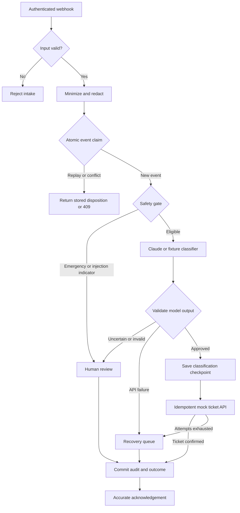
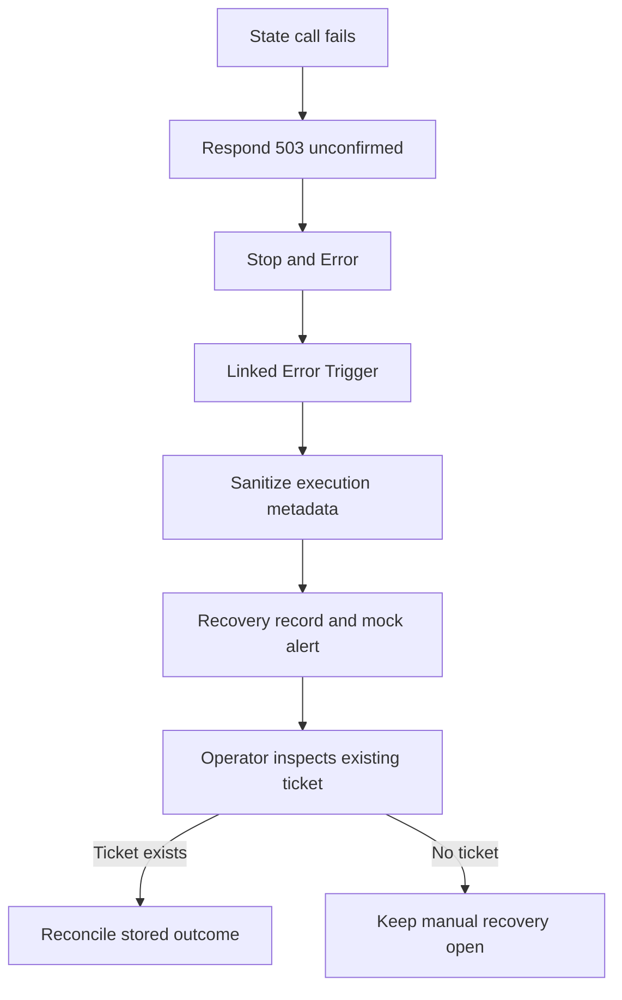

# Architecture and trust boundaries

[Open the architecture figure](architecture.svg) · [Actual n8n canvas](n8n-workflow.png)

The n8n canvas has more nodes than this diagram because HTTP calls, decisions, response handling, and error checks are independently visible.

## Boundaries

1. The incoming webhook authenticates with an n8n Header Auth credential. Incoming data may not supply URLs, prompts, credentials, fault settings, or automation permissions.
2. Code validates the allowlisted synthetic request schema. Only `PROP-DEMO-001` is accepted. Timestamps are accepted from the prior 30 days through five minutes in the future.
3. The raw message is normalized and used to compute a SHA-256 content fingerprint. The stored request contains redacted text. The model receives only `maintenance_text`, without property, unit, source event ID, or contact preference.
4. SQLite atomically claims the event ID using `BEGIN IMMEDIATE` plus a primary key. Matching concurrent requests cannot both own the event. Changed content with the same ID is a conflict.
5. Deterministic policy may route a request to review before the model. The model cannot override this route because it is never called on that branch.
6. The model produces an untrusted six-field JSON object. Code validates exact keys, types, enums, confidence bounds, summary length, flags, and completion status before routing.
7. Approved classification is checkpointed before ticket creation. The mock ticket store requires that exact approved payload and the owning trace ID.
8. The final event, review/recovery items, mock alert, and audit record are committed in one local database transaction. An acknowledgement follows the commit.

## Storage failure and error workflow

The Error Trigger starts a separate execution. It cannot send a response to the original webhook. The main workflow explicitly responds first when it detects a failed state operation. If the entire local storage service is down, the handler cannot persist its own records either; restore the service and inspect n8n's local logs. No exactly-once delivery guarantee is claimed across a total outage.

## External systems

- The real Claude branch calls Anthropic's official Messages API using an n8n credential.
- The fixture branch uses known synthetic responses and deterministic faults; it has no AI model.
- The second n8n workflow and SQLite ticket table simulate a ticketing API; they are not a Zendesk implementation.
- Alerts are local mock outbox records. No email, Teams, Jira, or dispatcher message is actually sent.
- The integration boundary could later use PostgreSQL/Supabase and an authorized ticket system, with proper schema, migrations, access controls, and API semantics. That migration is a future design discussion, not implemented experience.

